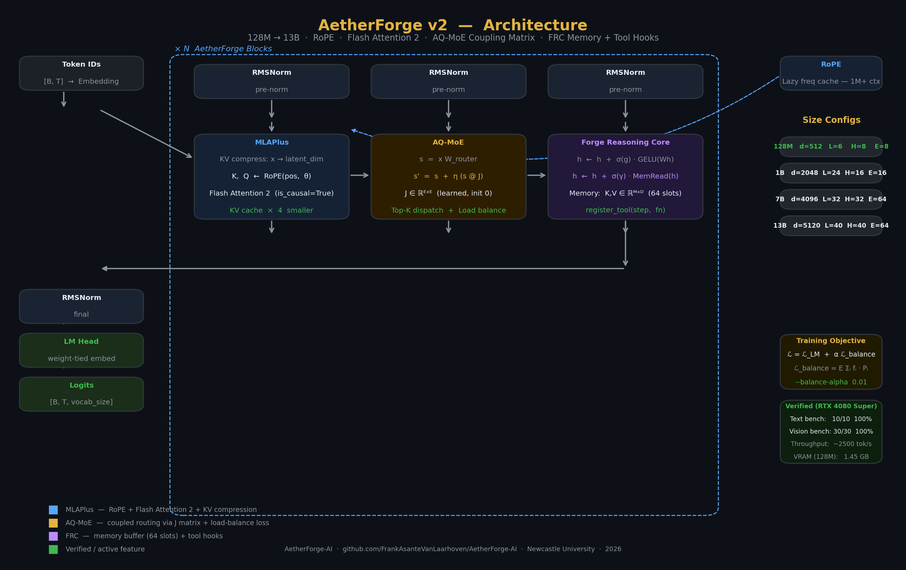

<p align="center">
  
</p>

<h1 align="center">AetherForge AI</h1>

<p align="center">
  <strong>A hybrid latent-entangled transformer + efficient fine-tuning toolkit</strong><br>
  Designed for consumer GPUs (RTX 4080 16GB and up)
</p>

<p align="center">
  <a href="#quick-start">Quick Start</a> •
  <a href="#architecture-aetherforge">Architecture</a> •
  <a href="#pretraining--multi-gpu">Pretraining</a> •
  <a href="#knowledge-distillation">Distillation</a> •
  <a href="#qwen25-vl-7b-fine-tuning">Qwen2.5-VL</a> •
  <a href="#training-dashboard">Dashboard</a> •
  <a href="#inference">Inference</a>
</p>

<p align="center">
  <a href="https://github.com/FrankAsanteVanLaarhoven/AetherForge-AI/releases/tag/v0.1.0"></a>
  <a href="https://python.org"></a>
  <a href="https://pytorch.org"></a>
  <a href="https://developer.nvidia.com/cuda-toolkit"></a>
  <a href="https://huggingface.co"></a>
  <a href="LICENSE"></a>
</p>

---

## What's Inside

| Component | Description |
|-----------|-------------|
| `aetherforge/model.py` | v2: RoPE, Flash Attention 2, AQ-MoE + coupling matrix J, FRC memory + tool hooks, gradient checkpointing, 128M–13B configs |
| `scripts/train_aetherforge.py` | Pretraining: FineWeb streaming, multi-GPU DDP (torchrun), gradient checkpointing, AMP, warmup+cosine LR, W&B |
| `scripts/distill_aetherforge.py` | Knowledge distillation: Qwen2.5-VL-7B teacher → AetherForge student; KL+CE mixed loss, response-only masking |
| `scripts/finetune_qwen25_vl.py` | Fine-tune Qwen2.5-VL-7B in 4-bit NF4 + LoRA (text or multimodal) |
| `scripts/serve.py` | FastAPI inference server: `/generate`, `/stream` (SSE), `/chat` — AetherForge or Qwen backend |
| `scripts/evaluate_model.py` | Text + vision benchmarks, perplexity, base vs. LoRA delta table |
| `scripts/merge_lora.py` | Merge LoRA adapter into base weights for standalone export |
| `scripts/inference_qwen25_vl.py` | Qwen2.5-VL text and vision inference with optional LoRA loading |
| `Training_Dashboard.ipynb` | 13-panel enterprise monitoring: KPIs, loss curves, heatmaps, correlation matrix, multi-run overlay |
| `docs/manuscript.md` | Full technical paper with LaTeX equations, evaluation tables, honest roadmap |
| `docs/model_card.md` | HF-style model card: architecture, training recipes, hardware budgets, citation |

---

## Architecture: AetherForge

<p align="center">
  
</p>


AetherForge v2 is a from-scratch decoder-only transformer with four architectural innovations over the baseline:

### 1. MLAPlus — Multi-Head Latent Attention + RoPE + Flash Attention

KV compression (DeepSeek-V2 MLA): keys and values share a low-rank bottleneck `latent_dim << d_model`, reducing KV cache size by `d_model/latent_dim`.  
RoPE (Rotary Position Embedding) replaces learned absolute positions — supports 1M+ token context via lazy frequency cache extension, no re-training needed.  
Attention is computed via `F.scaled_dot_product_attention(is_causal=True)` which dispatches to Flash Attention 2 CUDA kernels automatically.

```
x → Q [B, H, T, head_dim]  ← RoPE applied
  → latent → K, V [B, H, T, head_dim]  ← RoPE applied
  → Flash Attention (causal)
```

### 2. AQ-MoE — Adaptive Quantum-Inspired Mixture of Experts

Top-K routing with a learned E×E coupling matrix **J** capturing expert-to-expert correlations.  
Coupled router: `s_coupled = s + η · (s @ J)` — standard routing when J=0 at init, progressively learned.  
Load-balance loss `L_balance = E · Σ(f_i · P_i)` is added to the training objective (weight `--balance-alpha`).

```
s = router(x)                          # [N, E] standard scores
s_coupled = s + η * (s @ J)            # [N, E] with expert coupling
top-k dispatch → weighted expert sum
```

### 3. ForgeReasoningCore v2 — Memory Buffer + Tool Hooks

Gated iterative refinement (v1) plus:
- **Memory buffer**: 64 learned (key, value) slot pairs; each step reads via soft attention with a per-step gate init near zero.
- **Tool hooks**: `model.blocks[i].frc.register_tool(step, fn)` — call any Python function mid-reasoning (retrieval, calculator, code execution, structured extraction).

```python
# Register a retrieval tool on block 0, step 1
model.blocks[0].frc.register_tool(1, retrieval_fn)
```

### 4. Production Size Configs

```python
from aetherforge.model import MODEL_CONFIGS, AetherForge

# Instantiate by name
model = AetherForge.from_config("7B")

# Available presets
MODEL_CONFIGS = {
    "128M": dict(d_model=512,  n_layers=6,  n_heads=8,  n_experts=8,  ...),  # 1.45 GB VRAM
    "1B":   dict(d_model=2048, n_layers=24, n_heads=16, n_experts=16, ...),
    "7B":   dict(d_model=4096, n_layers=32, n_heads=32, n_experts=64, ...),
    "13B":  dict(d_model=5120, n_layers=40, n_heads=40, n_experts=64, ...),
}
```

Train with a preset:
```bash
python scripts/train_aetherforge.py --config 1B --tokenizer Qwen/Qwen2.5-VL-7B-Instruct
```

---

## Long Context — NTK-Aware RoPE Scaling

AetherForge extends to longer contexts at inference time without retraining, using
NTK-aware RoPE base scaling. Higher scale adjusts high-frequency components more
aggressively than low-frequency ones — superior to naive linear position interpolation.

```python
from aetherforge.model import AetherForge

# Load a standard 1B checkpoint
model = AetherForge.from_config("1B")
model.load_state_dict(torch.load("outputs/aetherforge_pretrain/final/model.pt"))

# Extend context by 4× at inference (no fine-tuning, minimal quality loss)
model.eval().extend_context(4.0)

# Now accepts sequences up to ~8K tokens trained at 2K
ids = torch.randint(0, 32000, (1, 8192))
logits = model(ids)   # works
```

Or use a long-context config preset directly:

```python
model = AetherForge.from_config("1B-8k")   # rope_scale=4.0 baked in
model = AetherForge.from_config("1B-32k")  # rope_scale=16.0 — 32K context
model = AetherForge.from_config("7B-32k")  # 7B with expanded memory slots
```

| Config | rope_scale | Approx. max context | VRAM (fp16) |
|--------|-----------|---------------------|-------------|
| `1B` | 1.0 | ~2K (training length) | ~4 GB |
| `1B-8k` | 4.0 | ~8K | ~4 GB |
| `1B-32k` | 16.0 | ~32K | ~4 GB |
| `7B-32k` | 16.0 | ~32K | ~14 GB |

---

## Pretraining + Multi-GPU

AetherForge pretraining supports three data modes, single-GPU AMP, and multi-GPU
DDP via `torchrun` — no code changes between single and multi-GPU.

```bash
# FineWeb streaming — no disk space needed, samples on the fly
conda run -n ml-torch python scripts/train_aetherforge.py \
    --stream --dataset HuggingFaceFW/fineweb --dataset-config sample-10BT \
    --config 128M --steps 10000

# Local JSONL + 1B model + gradient checkpointing (fits 16 GB at seq=512)
conda run -n ml-torch python scripts/train_aetherforge.py \
    --data data/synthetic_data.jsonl --config 1B \
    --gradient-checkpointing --seq-len 512 --steps 5000

# 4-GPU DDP  (eff. batch = batch × grad_accum × 4)
torchrun --nproc_per_node=4 scripts/train_aetherforge.py \
    --stream --config 7B --gradient-checkpointing \
    --batch-size 2 --grad-accum 8 --steps 100000 --wandb
```

### Key flags

| Flag | Default | Effect |
|------|---------|--------|
| `--stream` | off | Stream from HF instead of local JSONL |
| `--dataset` | `HuggingFaceFW/fineweb` | HF dataset repo id |
| `--dataset-config` | `sample-10BT` | Subset / config name |
| `--config` | — | Size preset: `128M` / `1B` / `7B` / `13B` |
| `--gradient-checkpointing` | off | Recompute activations (~40% VRAM saving) |
| `--balance-alpha` | 0.01 | AQ-MoE load-balance loss weight |
| `--wandb` | off | Log to Weights & Biases |
| `--resume` | — | Resume from checkpoint directory |

---

## Knowledge Distillation

Train AetherForge by learning from Qwen2.5-VL-7B-Instruct's soft output
distribution — no large raw-text corpus needed.

```
L = α · T² · KL(p_teacher ‖ p_student) + (1-α) · CE(student, labels)
```

Both models share the Qwen tokenizer so KL divergence is computed over the same
token space. Teacher visual-token logits are sliced before KL to avoid contaminating
text training with vision tokens. Response-only masking restricts both losses to
assistant turns.

```bash
# Smoke-test (25 steps, ~9.25 GB VRAM)
conda run -n ml-torch python scripts/distill_aetherforge.py --test-run

# Full distillation — built-in 240-sample dataset
conda run -n ml-torch python scripts/distill_aetherforge.py \
    --config 128M --temperature 3.0 --alpha 0.7 --steps 5000

# Your own JSONL  ({"instruction": "...", "response": "..."} per line)
conda run -n ml-torch python scripts/distill_aetherforge.py \
    --config 128M --data data/your_data.jsonl \
    --temperature 3.0 --alpha 0.7 --steps 10000 --wandb
```

### VRAM budget

| Component | VRAM |
|-----------|------|
| Teacher (Qwen2.5-VL-7B, 4-bit NF4) | ~6.0 GB |
| Student (AetherForge 128M, fp16) | ~0.9 GB (weights + optimizer) |
| Activations + teacher logit buffer | ~1.3 GB |
| **Total** | **~9.25 GB** |

---

## Quick Start

### 1. Install Dependencies

```bash
conda create -n aetherforge python=3.11 -y
conda activate aetherforge

pip install torch --index-url https://download.pytorch.org/whl/cu124
pip install -r requirements.txt
```

Or use the existing `ml-torch` conda environment if you have it:

```bash
conda run -n ml-torch pip install -r requirements.txt
```

### 2. Test the AetherForge Model

```bash
conda run -n ml-torch python aetherforge/model.py
# Device: cuda
# Parameters: 128.2M
# Forward pass: input (2, 128) -> logits (2, 128, 32000)
# VRAM: 0.69 GB
```

### 3. Train AetherForge from Scratch

```bash
# Smoke-test (no data needed, ~30 s)
conda run -n ml-torch python scripts/train_aetherforge.py --test-run

# Stream FineWeb — no local download
conda run -n ml-torch python scripts/train_aetherforge.py \
    --stream --config 128M --steps 10000

# Multi-GPU via torchrun
torchrun --nproc_per_node=4 scripts/train_aetherforge.py \
    --stream --config 1B --gradient-checkpointing --steps 50000
```

---

## Qwen2.5-VL-7B Fine-Tuning

[Qwen2.5-VL-7B-Instruct](https://huggingface.co/Qwen/Qwen2.5-VL-7B-Instruct) is a vision-language model that outperforms Llama 3.2 Vision on most multimodal benchmarks and is compatible with LoRA fine-tuning.

### Text-Only Fine-Tuning (no images required)

```bash
# Quick smoke test — 25 steps, verifies full pipeline
conda run -n ml-torch python scripts/finetune_qwen25_vl.py --mode text --test-run

# Full run — built-in 240-sample dataset or your own JSONL
conda run -n ml-torch python scripts/finetune_qwen25_vl.py --mode text

# With W&B logging and custom warmup
conda run -n ml-torch python scripts/finetune_qwen25_vl.py \
    --mode text \
    --warmup-steps 50 \
    --wandb
```

### Multimodal Fine-Tuning (text + images)

Dataset format — one JSON object per line in `data/vl_dataset.jsonl`:

```json
{"instruction": "What is in this image?", "response": "A hospital corridor with a robot.", "image": "/path/to/image.jpg"}
```

```bash
conda run -n ml-torch python scripts/finetune_qwen25_vl.py \
    --mode multimodal \
    --data data/vl_dataset.jsonl \
    --plot-every 10
```

Generate a ready-to-use multimodal dataset (20 hospital-scene images):

```bash
conda run -n ml-torch python multimodal_example/generate_dummy_data.py
conda run -n ml-torch python scripts/finetune_qwen25_vl.py \
    --mode multimodal \
    --data multimodal_example/multimodal_data.jsonl
```

### Hardware Requirements (RTX 4080 16GB)

| Setting | Value |
|---------|-------|
| Quantization | 4-bit NF4 + double quantization |
| LoRA rank | r=16, alpha=32 (adjustable via `--lora-r`) |
| Batch size | 1 |
| Gradient accumulation | 8 (effective batch = 8) |
| Precision | fp16 + gradient checkpointing |
| Optimizer | AdamW (wd=0.01) |
| LR schedule | Linear warmup → cosine decay |
| Loss masking | Response-only (user prompt masked to -100) |
| Expected VRAM | 11–14 GB |

### All Fine-Tuning Arguments

```
--mode          text | multimodal          Training mode
--data          path/to/data.jsonl        Dataset (uses built-in if omitted)
--output-dir    ./outputs/qwen25_vl_lora  Output directory
--batch-size    1                         Per-GPU batch size
--grad-accum    8                         Gradient accumulation steps
--max-length    256                       Sequence length (256 = safe on 16GB)
--lr            2e-4                      Peak learning rate
--epochs        1                         Number of epochs
--warmup-steps  20                        Linear LR warmup before cosine
--save-steps    50                        Checkpoint every N steps
--plot-every    20                        Re-save loss_curve.png every N steps
--lora-r        16                        LoRA rank (higher = more VRAM)
--wandb                                   Enable W&B logging
--wandb-project aetherforge               W&B project name
--test-run                                25-step smoke-test
```

### Inference

```bash
# Text
conda run -n ml-torch python scripts/inference_qwen25_vl.py \
    --prompt "Explain sparse mixture of experts"

# Vision + text
conda run -n ml-torch python scripts/inference_qwen25_vl.py \
    --prompt "What do you see?" \
    --image /path/to/image.jpg

# Load fine-tuned LoRA weights
conda run -n ml-torch python scripts/inference_qwen25_vl.py \
    --lora-path ./outputs/qwen25_vl_lora/final \
    --prompt "Describe the scene"

# Interactive REPL (prefix image path with img:<path>)
conda run -n ml-torch python scripts/inference_qwen25_vl.py --interactive
```

---

## Evaluation

```bash
# Text benchmark (10 questions, base model)
conda run -n ml-torch python scripts/evaluate_model.py --benchmark text

# Full benchmark: text + vision + perplexity
conda run -n ml-torch python scripts/evaluate_model.py \
    --benchmark all \
    --image-dir multimodal_example/images

# Compare base model vs. fine-tuned LoRA (prints a diff table)
conda run -n ml-torch python scripts/evaluate_model.py \
    --lora-path outputs/qwen25_vl_lora/final \
    --benchmark all \
    --compare-base
```

Baseline (Qwen2.5-VL-7B-Instruct, 4-bit, RTX 4080 Super):

| Benchmark | Score | VRAM |
|-----------|-------|------|
| Text (10 Q) | 10/10 (100%) | 5.9 GB |
| Vision (10 img × 3 Q) | 30/30 (100%) | 5.9 GB |
| Perplexity (reference texts) | 55.51 | — |

---

## Training Dashboard

Open `Training_Dashboard.ipynb` after any training run for enterprise-grade monitoring:

- **KPI header** — Final loss, best loss, peak VRAM, train time, throughput, steps
- **Loss panel** — Raw trace + Savitzky-Golay trend + ±1σ band + best-checkpoint marker
- **LR + VRAM** — LR schedule and VRAM with 16GB budget line
- **Throughput + Distribution** — Tok/s bars and loss histogram
- **Loss heatmap** — Epoch × step bucket grid (red → gold → green)
- **Correlation matrix** — Pearson r across all metrics
- **Audit table** — Sampled training log with best-step highlighted
- **Multi-run overlay** — Compare runs side-by-side (add entries to `RUNS` dict)

```bash
# Generate a test log first
make finetune-test     # or: make train-aetherforge-test

# Then open the dashboard
jupyter notebook Training_Dashboard.ipynb
```

---

## Interactive Chat

```bash
# Direct: AetherForge with checkpoint
conda run -n ml-torch python scripts/chat.py \
    --checkpoint outputs/aetherforge_pretrain/final/model.pt --config 128M

# Direct: Qwen2.5-VL (requires ~6 GB VRAM)
conda run -n ml-torch python scripts/chat.py --model qwen

# Via server: connect to a running serve.py
conda run -n ml-torch python scripts/chat.py --server http://localhost:8000

# Long-context: NTK-aware RoPE scaling (1B at ~8K tokens)
conda run -n ml-torch python scripts/chat.py --config 1B-8k
```

In-session commands: `/clear`, `/temp 0.5`, `/top_p 0.95`, `/tokens 500`, `/rep 1.2`, `/help`

---

## Inference Server

FastAPI server with OpenAI-compatible endpoints — swap in any OpenAI client by
changing the base URL.

```bash
# AetherForge 128M
conda run -n ml-torch python scripts/serve.py \
    --checkpoint outputs/aetherforge_pretrain/final/model.pt --config 128M

# AetherForge 1B with long-context (NTK-aware RoPE, rope_scale=4)
conda run -n ml-torch python scripts/serve.py --config 1B-8k \
    --checkpoint outputs/aetherforge_pretrain/final/model.pt

# AetherForge with real BPE tokenizer (not char-level)
conda run -n ml-torch python scripts/serve.py \
    --tokenizer Qwen/Qwen2.5-VL-7B-Instruct --config 128M

# Qwen2.5-VL-7B + LoRA adapter
conda run -n ml-torch python scripts/serve.py \
    --model qwen --lora-path outputs/qwen25_vl_lora/final
```

### Endpoints

| Endpoint | Method | Description |
|----------|--------|-------------|
| `/health` | GET | Liveness + uptime |
| `/info` | GET | Params, config, VRAM, tokenizer |
| `/generate` | POST | `{"prompt":"...","max_tokens":200,"temperature":0.8}` |
| `/stream` | POST | Same, true per-token SSE stream |
| `/chat` | POST | `{"messages":[{"role":"user","content":"..."}]}` |
| `/chat/stream` | POST | Chat with SSE stream |
| `/v1/models` | GET | OpenAI model listing |
| `/v1/completions` | POST | OpenAI Completions format (streaming supported) |
| `/v1/chat/completions` | POST | OpenAI Chat format (streaming supported) |

### cURL examples

```bash
# Generate
curl http://localhost:8000/generate \
    -H "Content-Type: application/json" \
    -d '{"prompt": "The transformer architecture", "max_tokens": 100}'

# True token streaming
curl http://localhost:8000/stream \
    -H "Content-Type: application/json" \
    -d '{"prompt": "Explain sparse MoE"}' \
    --no-buffer

# OpenAI-compatible chat
curl http://localhost:8000/v1/chat/completions \
    -H "Content-Type: application/json" \
    -d '{"model":"aetherforge","messages":[{"role":"user","content":"Hello"}],"stream":true}'

# Python openai client (drop-in)
python -c "
import openai
client = openai.OpenAI(base_url='http://localhost:8000/v1', api_key='none')
resp = client.chat.completions.create(
    model='aetherforge',
    messages=[{'role': 'user', 'content': 'What is Flash Attention?'}],
)
print(resp.choices[0].message.content)
"
```

### Swagger UI

Docs auto-generated at `http://localhost:8000/docs` — try every endpoint in the browser.

---

## Llama-3.1-8B 4-bit Inference

```bash
# Download model (requires Hugging Face account + Meta license acceptance)
# Visit https://huggingface.co/meta-llama/Llama-3.1-8B and accept the license first
conda run -n ml-torch python scripts/download_model.py

# Run inference
conda run -n ml-torch python scripts/run_4bit.py \
    --prompt "The robot detected an obstacle and"

# Interactive
conda run -n ml-torch python scripts/run_4bit.py --interactive
```

VRAM usage: ~5.5 GB (NF4 quantization).

---

## Model Comparison

| Model | VRAM (4-bit) | Use Case |
|-------|-------------|----------|
| AetherForge (128M) | 0.69 GB | Custom pretraining, research |
| Llama-3.1-8B | ~5.5 GB | General text generation |
| Qwen2.5-VL-7B | 11–14 GB | Vision + language tasks |

---

## Repository Structure

```
AetherForge-AI/
├── aetherforge/
│   ├── __init__.py                 # version = "0.1.0", public exports
│   └── model.py                   # MLAPlus · AQ-MoE · FRC · grad ckpt · 128M–13B configs
├── scripts/
│   ├── train_aetherforge.py       # Pretraining: FineWeb streaming, DDP, grad ckpt, AMP, W&B
│   ├── distill_aetherforge.py     # Knowledge distillation: Qwen teacher → AetherForge student
│   ├── finetune_qwen25_vl.py      # Qwen2.5-VL-7B LoRA fine-tuning (text + multimodal)
│   ├── serve.py                   # FastAPI server: /generate, /stream, /chat
│   ├── inference_qwen25_vl.py     # Qwen2.5-VL inference (text + vision, interactive)
│   ├── evaluate_model.py          # Text + vision benchmarks, perplexity, base vs LoRA diff
│   ├── merge_lora.py              # Merge LoRA adapter into base weights
│   ├── generate_architecture_diagram.py  # Regenerate docs/architecture.png
│   ├── run_4bit.py                # Llama-3.1-8B 4-bit NF4 inference
│   ├── download_model.py          # HF model download helper
│   └── save_quantized.py          # Save quantized model weights to disk
├── multimodal_example/
│   ├── generate_dummy_data.py     # Generate 20 hospital-scene PNG images + JSONL
│   ├── multimodal_data.jsonl      # Ready-to-use multimodal dataset
│   └── images/                    # 20 synthetic labeled images
├── Training_Dashboard.ipynb       # 13-panel enterprise monitoring dashboard
├── docs/
│   ├── architecture.png           # Dark-theme architecture diagram (200 DPI)
│   ├── model_card.md              # HF-style model card with training recipes + citation
│   ├── manuscript.md              # Technical paper: equations, tables, honest roadmap
│   └── splash.jpg                 # Hero banner
├── CHANGELOG.md                   # Phase 1–3 release history
├── Makefile                       # 20+ convenience targets  (make help)
├── environment.yml                # Full conda environment spec
├── requirements.txt
└── .gitignore
```

---

## References

- Vaswani et al. (2017). [Attention Is All You Need](https://arxiv.org/abs/1706.03762)
- DeepSeek-AI (2024). [DeepSeek-V2: A Strong, Economical, and Efficient MoE Language Model](https://arxiv.org/abs/2405.04434)
- Shazeer et al. (2017). [Outrageously Large Neural Networks: The Sparsely-Gated Mixture-of-Experts Layer](https://arxiv.org/abs/1701.06538)
- Dettmers et al. (2023). [QLoRA: Efficient Finetuning of Quantized LLMs](https://arxiv.org/abs/2305.14314)
- Hu et al. (2021). [LoRA: Low-Rank Adaptation of Large Language Models](https://arxiv.org/abs/2106.09685)
- Meta AI (2024). [Llama 3 Model Card](https://huggingface.co/meta-llama/Meta-Llama-3-8B)
- Qwen Team (2024). [Qwen2.5-VL Technical Report](https://huggingface.co/Qwen/Qwen2.5-VL-7B-Instruct)
